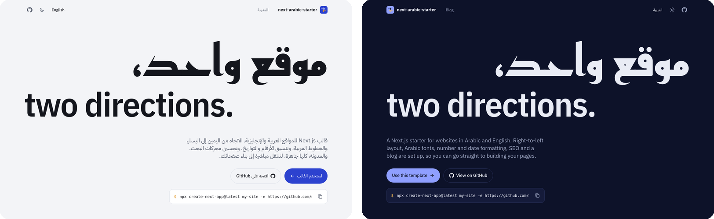
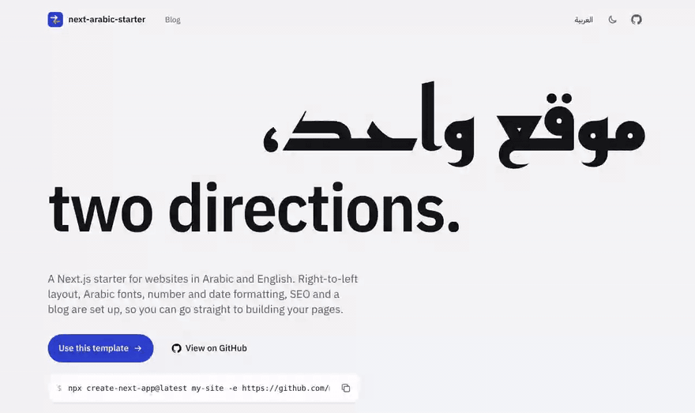
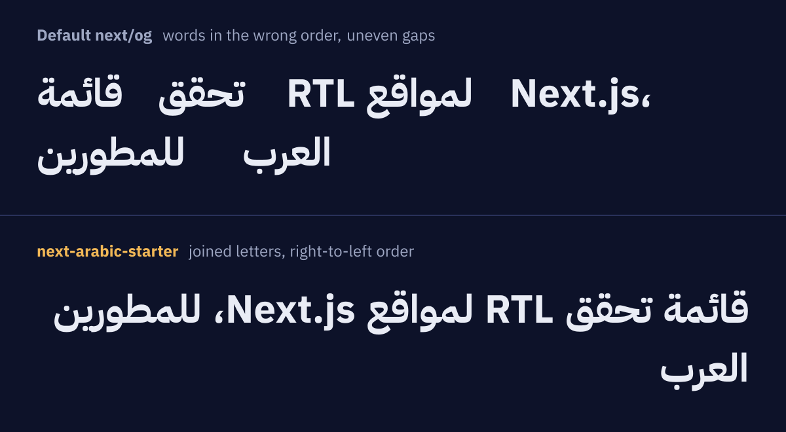

<p align="center">
  
</p>

<h1 align="center">next-arabic-starter</h1>

<div dir="rtl">

<p align="center">
  قالب Next.js للمواقع العربية والإنجليزية.<br>
  الاتجاه من اليمين إلى اليسار، والخطوط العربية، وتنسيق الأرقام والتواريخ، وتحسين محركات البحث، ومدونة MDX، كلها جاهزة.
</p>

<p align="center">
  <strong>النسخة الحية:</strong> <a href="https://next-arabic-starter.vercel.app/ar"><span dir="ltr">next-arabic-starter.vercel.app/ar</span></a>
  &nbsp;&nbsp;|&nbsp;&nbsp;
  <a href="README.md">Read in English</a>
</p>

---

كل موقع ثنائي اللغة، بالعربية والإنجليزية، يواجه المشكلات نفسها: تخطيط لا ينعكس، وخطوط غير متناسقة، وصيغ جمع وتواريخ هجرية تُكتب يدويًا، وروابط hreflang ناقصة، وصور مشاركة تظهر فيها الكلمات العربية بترتيب معكوس. هذا القالب يحل هذه المشكلات مرة واحدة، ليبدأ مشروعك الجديد من أساس جاهز بدلًا من صفحة فارغة.

</div>

<p align="center">
  
</p>

<div dir="rtl">

## ما الذي يتضمنه

- **توجيه حسب اللغة:** كل رابط يبدأ بلغته `/ar` أو `/en`، ويُوجَّه الزائر في أول زيارة إلى لغة متصفحه.
- **تخطيط من اليمين إلى اليسار:** خاصيتا `lang` و`dir` على وسم html، وكلاسات Tailwind منطقية في كل مكان، والبادئتان `rtl:` و`ltr:` تعملان حتى داخل اتجاهات متداخلة.
- **خطوط عربية:** خط IBM Plex Sans Arabic للنصوص وخط ريم كوفي للعناوين، والخطّان مستضافان داخل المشروع، فلا يُطلب أي شيء من Google.
- **التنسيق:** صيغ الجمع الست في العربية، والأرقام، والعملات، والتاريخ الميلادي والهجري (أم القرى)، مع خيار الأرقام الهندية (٠١٢٣).
- **مبدّل اللغة:** ينقلك إلى الصفحة نفسها باللغة الأخرى.
- **الوضع الداكن:** يتبع إعدادات النظام ويحفظ اختيار الزائر دون وميض عند التحميل.
- **تحسين محركات البحث:** عنوان ووصف لكل لغة، وروابط canonical وhreflang، وخريطة موقع متعددة اللغات، وملف `robots.txt`.
- **صور المشاركة:** صورة Open Graph لكل صفحة ومقالة، تظهر فيها العناوين العربية بشكل صحيح.
- **مدونة MDX:** مقالات بصيغة Markdown مع مكوّنات React، في مجلد لكل لغة، دون نظام لإدارة المحتوى.
- **ترجمات مُتحقَّق منها:** مفاتيح الترجمة مُعرَّفة الأنواع في TypeScript، والأمر `npm run check:i18n` يقارن بين اللغات.
- **ملف AGENTS.md:** يشرح قواعد RTL لمساعدي البرمجة بالذكاء الاصطناعي، لتنعكس الشيفرة التي يكتبونها بشكل صحيح أيضًا.

مبني على Next.js 16 وReact 19 وnext-intl 4 وTailwind CSS 4 وTypeScript، وكل الصفحات ثابتة تُبنى مسبقًا.

## البدء السريع

</div>

```bash
npx create-next-app@latest my-site -e https://github.com/mahmoudaladin7/next-arabic-starter
cd my-site
npm run dev
```

<div dir="rtl">

افتح [localhost:3000](http://localhost:3000). ويمكنك أيضًا الضغط على **Use this template** أعلى هذه الصفحة، أو نشر نسخة مباشرة:

</div>

[](https://vercel.com/new/clone?repository-url=https%3A%2F%2Fgithub.com%2Fmahmoudaladin7%2Fnext-arabic-starter)

<div dir="rtl">

### خصّص القالب

1. غيّر اسم الموقع ورابطه وروابطك في `src/config/site.ts`.
2. استبدل النصوص في `messages/ar.json` و`messages/en.json`.
3. استبدل الصفحة الرئيسية في `src/app/[locale]/page.tsx`، ويمكنك حذف العروض التوضيحية في `src/components/home/`.
4. اكتب مقالاتك في `src/content/blog/`، أو احذف المدونة.
5. احذف مجلد `docs/` (فيه صور هذا الملف فقط).
6. عند النشر، اضبط `NEXT_PUBLIC_SITE_URL` على نطاقك (تملؤه Vercel تلقائيًا إن تركته).

## قواعد سريعة

- استخدم `ms-4` و`ps-4` و`start-0` و`text-start` بدل `ml-4` و`pl-4` و`left-0` و`text-left`.
- اعكس الأيقونات التي تشير إلى اتجاه بـ `rtl:-scale-x-100`، ولا تعكس الشعارات وعلامات الصح.
- ضع الشيفرة وأرقام الهواتف داخل النص العربي في وسم `<span dir="ltr">`.
- لا تكتب الأرقام والتواريخ والجمع يدويًا، بل استخدم `getFormatter` و`getTranslations` من next-intl.
- لا تضف `letter-spacing` إلى النص العربي.

الشرح الكامل مع الأمثلة في [النسخة الإنجليزية من هذا الملف](README.md#guide)، وفي [قائمة تحقق RTL](https://next-arabic-starter.vercel.app/ar/blog/rtl-checklist) و[إضافة لغة ثالثة](https://next-arabic-starter.vercel.app/ar/blog/adding-a-language) على مدونة النسخة الحية.

## صور المشاركة بالعربية

مكتبة `next/og` تحوّل JSX إلى صورة، لكنها لا تتعامل مع النص من اليمين إلى اليسار، فتظهر الكلمات العربية بترتيب معكوس وبفراغات غير متساوية. الملف `src/lib/og/arabic-text.ts` يصل الحروف بأشكالها المتصلة، ويرتّبها ترتيبًا مرئيًا، ويصفّ الكلمات من اليمين إلى اليسار مع الحفاظ على الكلمات اللاتينية والأرقام.

</div>

<p align="center">
  
</p>

<div dir="rtl">

## الرخصة

رخصة [MIT](LICENSE). الخطوط في `src/fonts` مرخّصة برخصة SIL Open Font License.

من تطوير [محمود علاء الدين](https://mahmoudaladin.netlify.app).

</div>
